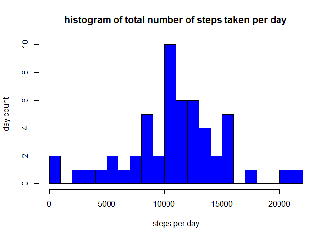
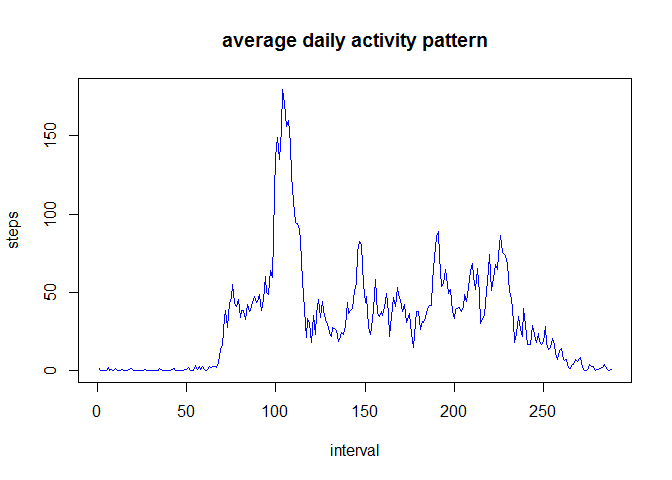
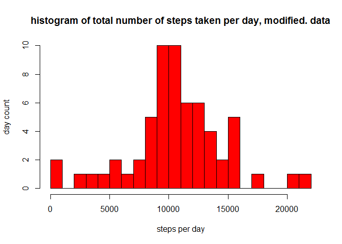
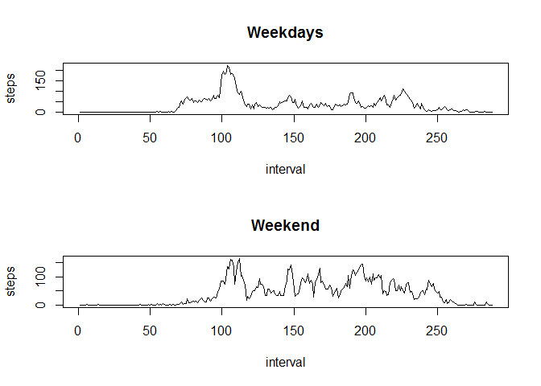

# Activity monitoring exercise

This is an R Markdown document including analysis for Activity monitoring data loaded from course webpage. 

loading ang and preprocessing data
--------------------------------------

Loading the data from file stored in working folder and preprosessing by creating new colum for date information in "date" format. 


```r
data <-read.csv("activity.csv")
data$Date <- as.Date(data$date, "%Y-%m-%d")
str(data)
```

```
## 'data.frame':	17568 obs. of  4 variables:
##  $ steps   : int  NA NA NA NA NA NA NA NA NA NA ...
##  $ date    : Factor w/ 61 levels "2012-10-01","2012-10-02",..: 1 1 1 1 1 1 1 1 1 1 ...
##  $ interval: int  0 5 10 15 20 25 30 35 40 45 ...
##  $ Date    : Date, format: "2012-10-01" "2012-10-01" ...
```


What is mean total number of steps taken per day?
--------------------------------------

1. Make a histogram of the total number of steps taken per day

First calculating the meand and median for number of steps taken per day, NA's are ignored (left out) from analysis.  


```r
#Total number of steps taken per day
TotStepsDay <- tapply(data$steps,data$Date,sum)
#
hist(TotStepsDay,n=20, col="blue", main="histogram of total number of steps taken per day", ylab="day count", xlab="steps per day")
```

 

```r
#
```
2. Calculate and report the mean and median total number of steps taken per day

```r
MeanStepsDay <- mean(TotStepsDay,na.rm=TRUE)
MeanStepsDay
```

```
## [1] 10766.19
```

```r
MedianStepsDay <-median(TotStepsDay,na.rm=TRUE)
MedianStepsDay
```

```
## [1] 10765
```

What is the daily average activity pattern?
------------------------------------------

Next calculating Average daily activity pattern and finding the interval which holds max number of steps in average. 


```r
MeanStepsInterval <- tapply(data$steps,data$interval,sum,na.rm="TRUE")
MeanStepsIntDay <- MeanStepsInterval / length(levels(as.factor(data$Date)))
plot(MeanStepsIntDay, type="l",col="blue", xlab="interval", ylab="steps", main="average daily activity pattern")
```

 

```r
#which interval has maximum number of steps in average over all days
MeanStepsIntDay[which.max(MeanStepsIntDay)]
```

```
##      835 
## 179.1311
```
so the interval with highest number of steps is at 08:35 with 179 steps


Imputing missing values: 
-----------------------------
1. Total number of missing values in data set

```r
emptyLines <- sum(is.na(data$steps))
emptyLines
```

```
## [1] 2304
```
There are 2304 missing values for the recorded "steps" in the data. 

2. filling missing values with strategy: fill missing value with mean value for that interval over all days. The average value per interval was calculated already in earlier step.  

```r
data$steps.recode <- ifelse(is.na(data$steps), MeanStepsIntDay, data$steps)
```

3. create new data set with recoded values (named as data2)

```r
data2 <- data.frame(data$steps.recode,data$Date,data$interval)
colnames(data2) <-c("steps","Date","interval")
str(data2)
```

```
## 'data.frame':	17568 obs. of  3 variables:
##  $ steps   : num  1.4918 0.2951 0.1148 0.1311 0.0656 ...
##  $ Date    : Date, format: "2012-10-01" "2012-10-01" ...
##  $ interval: int  0 5 10 15 20 25 30 35 40 45 ...
```
4. Making histogram of number of steps taken each day and calculating Mean and Median values for modified data. 

```r
TotStepsDay2 <- tapply(data2$steps,data2$Date,sum)
#
hist(TotStepsDay2,n=20, col="red", ylab="day count", xlab="steps per day",main="histogram of total number of steps taken per day, modified. data")
```

 

```r
#
MeanStepsDay2 <- mean(TotStepsDay2,na.rm=TRUE)
MeanStepsDay2
```

```
## [1] 10581.01
```

```r
#
MedianStepsDay2 <- median(TotStepsDay2,na.rm=TRUE)
MedianStepsDay2
```

```
## [1] 10395
```

Both the mean and median value for modified data are slightly lower than for original data. This indicates that missing values were recorded during periods when the activity is lower than avegage activity over whole day. 


Activity patterns for weekends and weekdays 
----------------

1. creating factor type of indicator in data set to indicate wheter day is weekday or weekend
(finnish locals used below to indicate weekend). 

```r
data2$week <- as.factor(ifelse(weekdays(data2$Date) %in% c("lauantai","sunnuntai"), "Weekend", "Weekday"))
```
2. Steps taken per interval for weekdays and weekend. 


```r
#first some subsetting and calculation (there are probably more straighforward ways to do this)
WeedayData2 <-subset(data2, data2$week == "Weekday")
WeekendData2 <-subset(data2, data2$week == "Weekend")
#
#
MeanStepsIntervalWeekday <- tapply(WeedayData2$steps,WeedayData2$interval,sum,na.rm="TRUE")
MeanStepsIntDayWeekday <- MeanStepsIntervalWeekday / length(levels(as.factor(WeedayData2$Date)))
#
MeanStepsIntervalWeekend <- tapply(WeekendData2$steps,WeekendData2$interval,sum,na.rm="TRUE")
MeanStepsIntDayWeekend <- MeanStepsIntervalWeekend / length(levels(as.factor(WeekendData2$Date)))
#plotting the grapsh
par(mfrow=c(2,1))
plot(MeanStepsIntDayWeekday, type="l", ylab ="steps",xlab="interval",main="Weekdays")
plot(MeanStepsIntDayWeekend, type="l", ylab ="steps",xlab="interval",main="Weekend")
```

 

The average activity pattern is sligtly different if compared between weekends and weekdays. Especially during morning before 10 AM there is less activity during weekends and late in the evening there is more activity. 

The exercise completes here!

